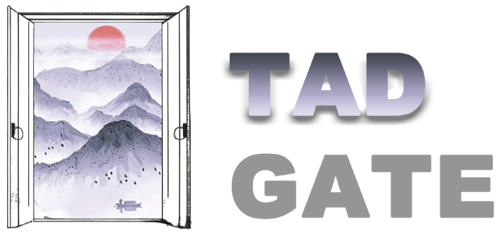
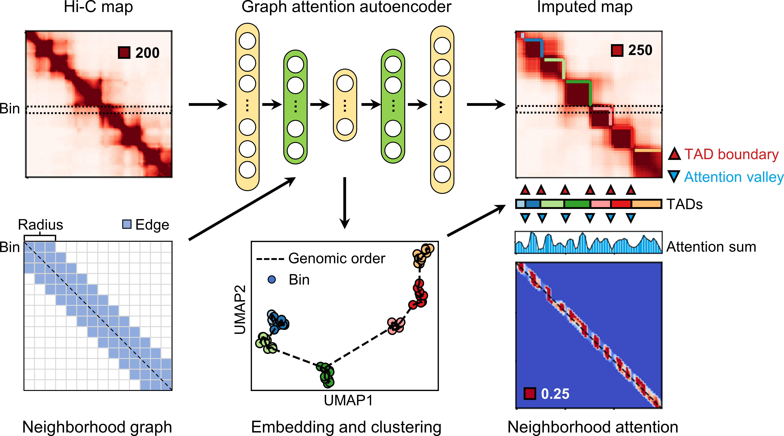
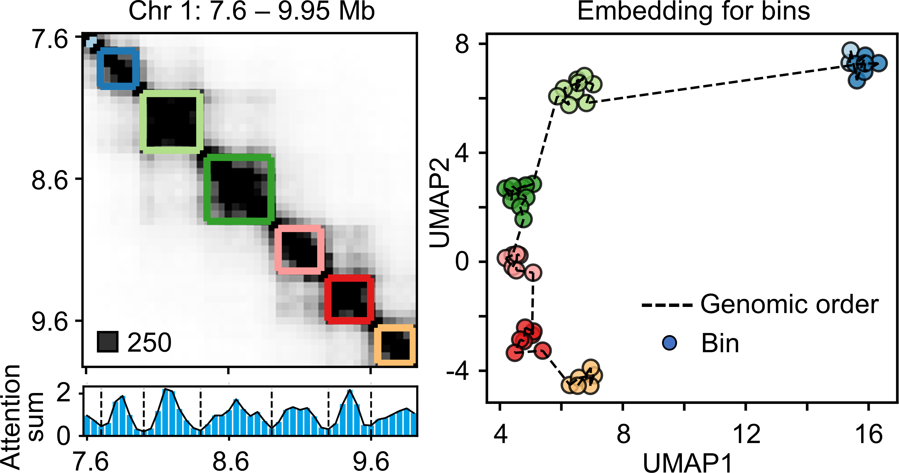
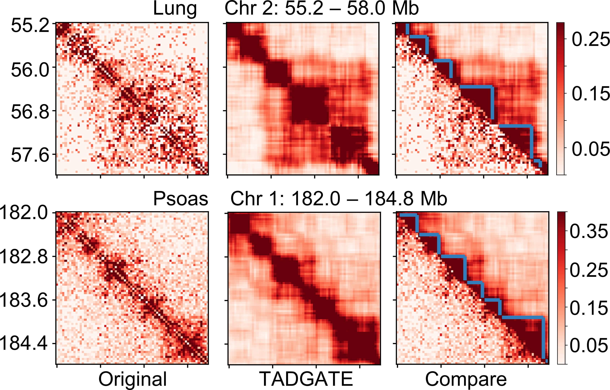

## TADGATE 



<div style="text-align: justify;">Topologically associating domains (TADs) have emerged as basic structural and functional units of genome organization. However, accurately identifying TADs from sparse chromatin contact maps <br> remain challenging. Here, we developed TADGATE to identify TADs <br> in Hi-C contact map with a graph attention autoencoder. It impute <br> and smooth the sparse chromatin contact maps while preserving or enhancing their topological domains. TADGATE can output imputed <br> Hi-C contact maps with clear topological structures. Additionally, it can provide embeddings for each chromatin bin, and the learned attention patterns can effectively depict the positions of TAD boundaries.</div>


## Overview

TADGATE consists of several steps:

1. Construct a neighborhood graph to reflect the adjacency relationship of chromatin bins in the genome.
2. Each bin serves as a sample and its interaction vector serves as the sample feature. We train a  graph attention autoencoder with the pre-defined neighborhood graph (green layers with graph attention) to reconstruct the interaction vector of each bin.  
3. We can get the embeddings for each chromatin bin and all the reconstructed interaction vectors constitute the imputed map.  The valleys in the attention sum profile of the attention map correspond well to the TAD boundaries in the contact map.
4. We can combine the original and the imputed Hi-C contact maps, the embeddings of chromatin bins, and attention patterns learned by the model to identify TADs.


<p align="center">


</p>

TADGATE can provide good embeddings to represent bins within each TAD.
<br>

<p align="center">


</p>
TADGATE can impute the sparse chromatin contact maps with enhanced topological domains.
<br>
<br>
<p align="center">


</p>


## Getting start

### Installation

The TADGATE package is developed based on the Python libraries [Scanpy](https://scanpy.readthedocs.io/en/stable/), [PyTorch](https://pytorch.org/) and [PyG](https://github.com/pyg-team/pytorch_geometric) (*PyTorch Geometric*) framework, and can be run on GPU (recommend) or CPU.


First clone the repository. 

~~~
git clone https://github.com/zhanglabtools/TADGATE.git
cd TADGATE
~~~

It's recommended to create a separate conda environment for running TADGATE:

```shell
#create an environment
conda create -n TADGATE python=3.8
#activate your environment
conda activate TADGATE
```

Install TADGATE with two methods:

1. Install TADGATE by PyPI

~~~
pip install TADGATE
~~~

2. Or install from source code

```shell
pip install .
```


The use of the mclust algorithm  requires the rpy2 package (Python) and the mclust package (R). See https://pypi.org/project/rpy2/ and https://cran.r-project.org/web/packages/mclust/index.html for detail.  (optional)


### Tutorial

See [TADGATE usage.ipynb](./Tutorial/TADGATE_usage.ipynb).

The data used in the tutorial can be downloaded [here](https://drive.google.com/drive/folders/1B6Hp3kUgmjkm-IIIQZ7A3WR3iwEgtb0O).

### Support

If you have any issues, please let us know. We have a mailing list located at:

* dangdachang@163.com

### Citation

If TADGATE is used in your research, please cite our paper:

> Uncovering topologically associating domains from three-dimensional genome maps with TADGATE.
> Dachang Dang, Shao-Wu Zhang, Kangning Dong, Ran Duan, Shihua Zhang
