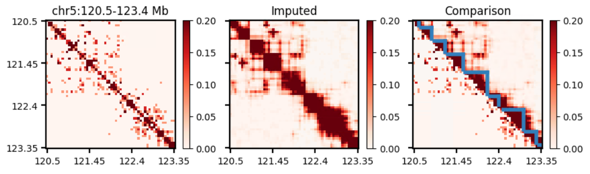
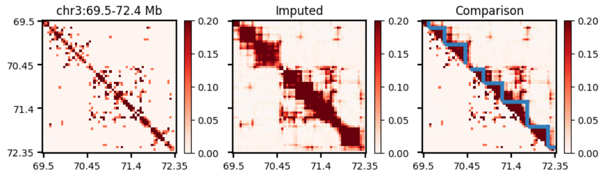

## TADGATE 


<div style="text-align: justify;">Topologically associating domains (TADs) have emerged as basic structural and functional units of genome organization. However, accurately identifying TADs from sparse chromatin contact maps <br> remain challenging. Here, we developed TADGATE to identify TADs <br> in Hi-C contact map with a graph attention autoencoder. It impute <br> and smooth the sparse chromatin contact maps while preserving or enhancing their topological domains. TADGATE can output imputed <br> Hi-C contact maps with clear topological structures. Additionally, it <br> can provide embeddings for each chromatin bin, and the learned <br> attention patterns effectively depict the positions of TAD boundaries.</div>


## Overview


<p align="center">


</p>

TADGATE can provide good embeddings to represent bins within each TAD.
<br>

<p align="center">


</p>
TADGATE can impute the sparse chromatin contact maps with enhanced topological domains.
<br>
<p align="center">

</p>
TADGATE can impute the single-cell chromatin contact maps and identify TAD-like domains.
<br>
<p align="center">

</p>
<p align="center">
  
</p>

## Getting start

### Installation

The TADGATE package is developed based on the Python libraries [Scanpy](https://scanpy.readthedocs.io/en/stable/), [PyTorch](https://pytorch.org/) and [PyG](https://github.com/pyg-team/pytorch_geometric) (*PyTorch Geometric*) framework, and can be run on GPU (recommend) or CPU.


First clone the repository. 

~~~
git clone https://github.com/zhanglabtools/TADGATE.git
cd TADGATE
~~~

It's recommended to create a separate conda environment for running TADGATE:

```shell
#create an environment
conda create -n TADGATE python=3.8
#activate your environment
conda activate TADGATE
```

Install TADGATE with two methods:

1. Install TADGATE by PyPI

~~~
pip install TADGATE
~~~

2. Or install from source code

```shell
pip install .
```


The use of the mclust algorithm  requires the rpy2 package (Python) and the mclust package (R). See https://pypi.org/project/rpy2/ and https://cran.r-project.org/web/packages/mclust/index.html for detail.  You can also use K-means for instead, if you can't use mclust.


### Tutorial

TADGATE support four kinds of input format of Hi-C contact map: dense contact matrix, sparse contact matrix, .hic file produced by [juicer tools](https://github.com/aidenlab/juicer) or .mcool file produced by [cooler](https://github.com/open2c/cooler).

More detailed information can be seen in [TADGATE usage.ipynb](./Tutorial/TADGATE_usage.ipynb).

The data used in the tutorial can be downloaded [here](https://drive.google.com/drive/folders/1B6Hp3kUgmjkm-IIIQZ7A3WR3iwEgtb0O).

### For Command Line Interface(CLI) user

The parameter file for TADGATE needs to be prepared according to the file in [the example](./parameters.txt).

```
cd TADGATE
python TADGATE_CLI.py [path/to/you/paramaters.txt]
```

### Support

If you have any issues, please let us know. We have a mailing list located at:

* dangdachang@163.com

### Citation

If TADGATE is used in your research, please cite our paper:
>Dachang Dang, Shao-Wu Zhang, Kangning Dong, Ran Duan, Shihua Zhang, Uncovering topologically associating domains from three-dimensional genome maps with TADGATE, 
>Nucleic Acids Research, 2024;, gkae1267, https://doi.org/10.1093/nar/gkae1267
